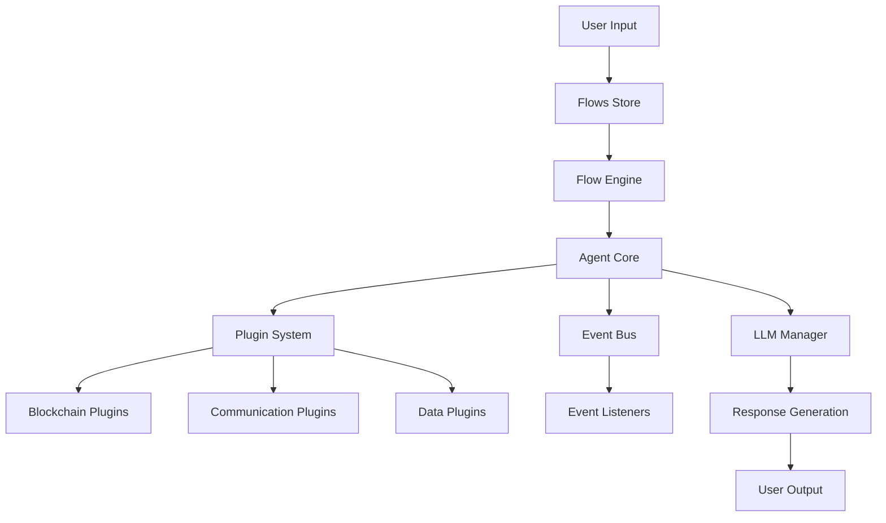

# SkynetXBT Framework
{: .fs-9 }

Advanced agentic framework combining blockchain technology with AI-powered automation.
{: .fs-6 .fw-300 }

[Get Started]({{ site.baseurl }}/getting-started){: .btn .btn-primary .fs-5 .mb-4 .mb-md-0 .mr-2 }
[View on GitHub](https://github.com/spheronFdn/skynetxbt){: .btn .fs-5 .mb-4 .mb-md-0 }

---

## Quick Navigation

### 👤 **For Users**
- **[User Guide]({{ site.baseurl }}/user-guide/)** - How to use SkynetXBT flows and features
- **[Flow Catalog]({{ site.baseurl }}/user-guide/flows/)** - Complete list of flows with inputs/outputs
- **[Getting Started]({{ site.baseurl }}/getting-started/)** - Installation and first steps

### 🛠️ **For Developers**  
- **[Developer Guide]({{ site.baseurl }}/developer-guide/)** - Technical documentation and API references
- **[Flows API]({{ site.baseurl }}/developer-guide/flows-api/)** - Build and integrate custom flows
- **[Core Architecture]({{ site.baseurl }}/developer-guide/core-api/)** - Framework internals

---

## What is SkynetXBT?

SkynetXBT is a modular, event-driven framework that enables the creation of intelligent agents capable of:

- **🤖 AI-Powered Decision Making** - Integration with multiple LLM providers
- **⛓️ Blockchain Interactions** - Smart contract automation and DeFi operations  
- **🔄 Flow Orchestration** - Composable workflows for complex tasks
- **📱 Multi-Channel Communication** - Telegram, webhooks, and API integrations
- **🔌 Extensible Plugin System** - Custom functionality through plugins

## Flow Architecture Overview

{: .text-center }

*Visual representation of how flows, agents, and plugins work together in the SkynetXBT ecosystem*
{: .text-center .text-grey-dk-000 .fs-3 }

## System Architecture

## Key Components

### 🔗 **Flows**
Self-contained execution units that process inputs and generate outputs. Each flow serves a specific purpose like yield analysis, smart contract interaction, or data processing.

### 🤖 **Agents** 
Intelligent orchestrators that coordinate multiple flows, maintain context, and make decisions based on user interactions and environmental changes.

### 🔌 **Plugins**
Modular extensions that provide specialized functionality for blockchain interactions, external APIs, data processing, and communication channels.

### 📊 **Flows Store**
Dynamic registry and management system for discovering, installing, and executing flows across the ecosystem.

## Popular Use Cases

### 💰 **DeFi Automation**
- Automated yield farming strategies
- Portfolio rebalancing and optimization  
- Cross-chain arbitrage opportunities
- Liquidity pool analysis and management

### 📈 **Trading & Analytics**
- Real-time market data analysis
- Automated trading signal generation
- Risk assessment and portfolio monitoring
- DeFi protocol performance tracking

### 🤖 **AI Agents**
- Conversational AI with blockchain capabilities
- Smart contract interaction via natural language
- Automated research and data extraction
- Multi-modal content generation

### 📱 **Communication & Alerts**
- Telegram bot integrations
- Webhook-based notifications
- Cross-platform message broadcasting
- Event-driven alert systems

## Framework Benefits

- **🚀 Rapid Development** - Pre-built flows and plugins accelerate development
- **🔒 Security First** - Built-in security practices and audit capabilities
- **📊 Production Ready** - Enterprise-grade reliability and monitoring
- **🔧 Highly Customizable** - Extensible architecture for custom requirements
- **🌐 Multi-Chain Support** - EVM-compatible blockchain integrations
- **📖 Comprehensive Documentation** - Detailed guides for users and developers

## Getting Started

### For Users
1. **[Install the Flows Store]({{ site.baseurl }}/getting-started/#installation)** - Get the CLI tool
2. **[Browse Available Flows]({{ site.baseurl }}/user-guide/flows/)** - See what's available
3. **[Run Your First Flow]({{ site.baseurl }}/getting-started/#first-flow)** - Try a simple example

### For Developers  
1. **[Set Up Development Environment]({{ site.baseurl }}/developer-guide/#quick-start-for-developers)** - Install core dependencies
2. **[Understand Core Concepts]({{ site.baseurl }}/developer-guide/flows-api/)** - Learn the architecture
3. **[Build Your First Flow]({{ site.baseurl }}/developer-guide/flows-api/#creating-a-new-flow)** - Create custom functionality

---

## Community & Support

- **GitHub**: [spheronFdn/skynetxbt](https://github.com/spheronFdn/skynetxbt)
- **Documentation**: [skynetxbt.github.io](https://skynetxbt.github.io)
- **Issues**: [GitHub Issues](https://github.com/spheronFdn/skynetxbt/issues)
- **Discussions**: [GitHub Discussions](https://github.com/spheronFdn/skynetxbt/discussions)

## Contributing

SkynetXBT is open source and welcomes contributions. Whether you want to:
- Report bugs or suggest features
- Contribute code improvements
- Create new flows or plugins  
- Improve documentation

Check out our [Contributing Guide]({{ site.baseurl }}/developer-guide/contributing/) to get started.

---

**Ready to explore?** Start with our [Getting Started Guide]({{ site.baseurl }}/getting-started/) or dive into the [Flow Catalog]({{ site.baseurl }}/user-guide/flows/) to see what's possible.
